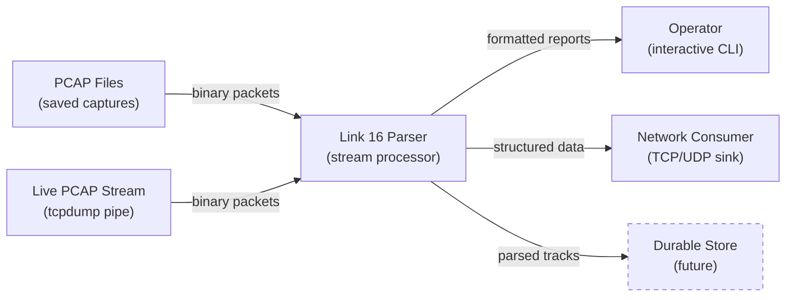
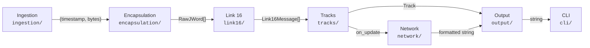
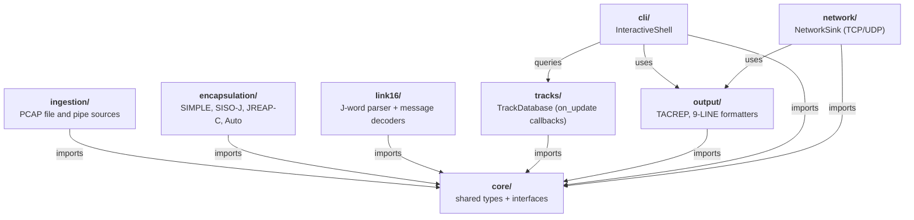
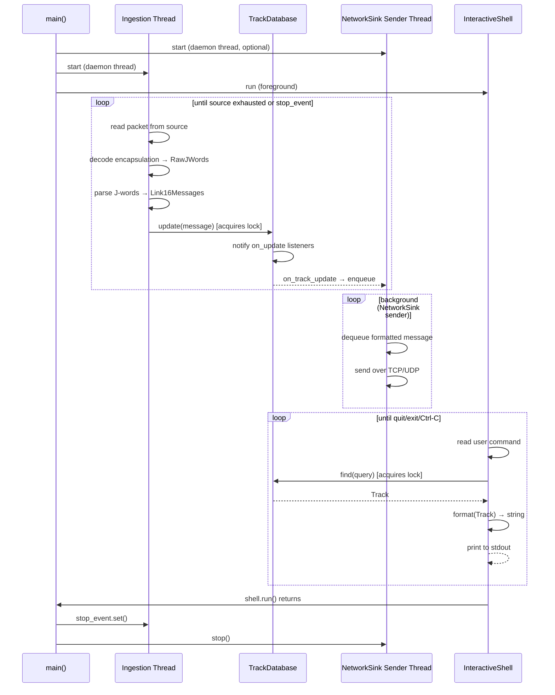
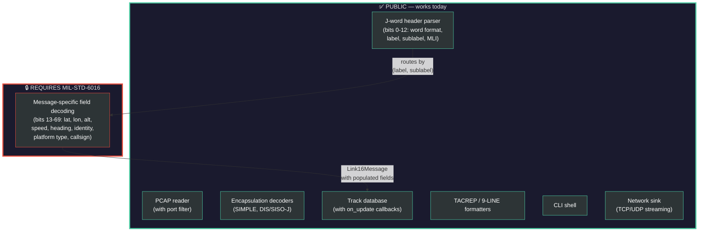

# Architecture Overview

This tool is a **stream processor** for Link 16 tactical data link
traffic. It transforms raw PCAP data — whether from static capture
files or a live network pipe — into structured track data and formatted
tactical reports in real time. It is not a database of record — it
parses, correlates, and forwards, but does not durably store anything
itself.

---

## Where This Tool Fits

PCAP data is the input — either saved capture files (post-mission
analysis) or a live stream piped from `tcpdump` or similar (real-time
monitoring). Either way, the data arrives as unparsed binary packets
that can't be queried or displayed directly. This tool sits between
that raw PCAP input and whatever needs the parsed data — an operator
reading TACREPs, a remote system consuming a network feed, or a
durable database for post-mission playback.



### Why there is no "SocketSource"

This tool **does not capture packets from the network**. It only reads
captures — either files on disk or a PCAP stream piped to stdin. The
actual packet capture is always performed by an external tool (tcpdump,
tshark, dumpcap, Wireshark, etc.).

This is a deliberate boundary:

- **No elevated privileges required.** Packet capture needs root or
  `CAP_NET_RAW`. This tool runs as a normal user.
- **No native dependencies.** Capture APIs are OS-specific (libpcap,
  AF_PACKET, WinPcap). This tool uses only the Python standard library.
- **Same tool for live and historical data.** A file from last month
  and a pipe from a live interface both enter as the same byte format.
- **Portability.** Runs anywhere Python runs, regardless of OS or
  network stack.

For live monitoring, the pattern is:

```
tcpdump -i eth0 -w - | link16-parser --pipe
```

The `-w -` flag tells tcpdump to write PCAP to stdout. The tool reads
it from stdin. The user sets up the capture; the tool handles the
parsing. This is a one-line setup, using tools operators are already
familiar with.

### Stateless across runs

The parser holds track state in memory for the duration of a session,
but nothing persists when the process exits. Re-processing a PCAP
produces identical output. This makes the tool a pure function of its
input: capture data in, structured track data out.

A durable store (SQLite, flat files, etc.) would plug in as another
output sink via the existing `OutputSink` / `on_update()` mechanism,
receiving every parsed track update without modifying the parser itself.

The next section explodes the "Link 16 Parser" box into its internal
pipeline stages.

---

## Internal Data Flow

The parser is a linear pipeline of components. Each component consumes
one data type and produces the next. No component knows the internals
of any other — they communicate only through the shared types defined
in `core/types.py` and the interfaces defined in `core/interfaces.py`.



### Component-by-component

| Component | Package | Interface | Input | Output | Notes |
|-----------|---------|-----------|-------|--------|-------|
| **Ingestion** | `ingestion/` | `PacketSource` | PCAP bytes (file or pipe) | `(float, bytes)` tuples | Strips Ethernet/IP headers. Optional `--port` filter. |
| **Encapsulation** | `encapsulation/` | `EncapsulationDecoder` | UDP/TCP payload bytes | `list[RawJWord]` | Pluggable: SIMPLE, SISO-J, JREAP-C, Auto |
| **Link 16** | `link16/` | `MessageDecoder` | `list[RawJWord]` | `list[Link16Message]` | Header parsing (public) + message decoding (needs MIL-STD-6016) |
| **Tracks** | `tracks/` | — | `Link16Message` | `Track` (stored) | In-memory, thread-safe, keyed by STN. Push via `on_update()`. |
| **Output** | `output/` | `OutputFormatter` | `Track` | `str` | Pluggable: TACREP, 9-LINE, future formats |
| **CLI** | `cli/` | — | User commands | Formatted reports | Pull-based: queries Tracks, uses Output to format |
| **Network** | `network/` | `OutputSink` | `Track` (via callback) | Bytes over TCP/UDP | Push-based: uses Output to format, streams to remote endpoint |

---

## Python Module Map

Arrows point toward the dependency ("A → B" means A imports from B).
Every package also imports from `core/` — those arrows are omitted to
reduce clutter. `__main__.py` imports from every package to wire the
pipeline together; it is the only module that knows about all components.



Each box is a Python package. Internal structure (which files, which
classes) is covered in the component-by-component sections below.

---

## Threading Model



The system uses up to three threads:

- **Ingestion thread** (daemon): reads packets, decodes, updates the
  track database. Sole writer to the DB.
- **CLI thread** (foreground): reads user commands, queries the DB.
  Sole interactive reader.
- **NetworkSink sender thread** (daemon, optional): drains a queue of
  formatted messages and sends them over TCP/UDP. Activated only when
  `--output-host` and `--output-port` are specified.

All threads share the `TrackDatabase`, protected by a single
`threading.Lock`. The `on_track_update()` callback runs inside the DB
lock and must not block — `NetworkSink` enqueues without waiting on I/O.

In `--pipe` mode, `PipeSource` consumes stdin for PCAP data, so the
interactive shell reads input from `/dev/tty` (the controlling terminal)
instead. If no terminal is available (cron, Docker, CI), the tool runs
in **headless mode**: ingestion only, no shell, exits when the source
is exhausted or on Ctrl-C.

---

## The MIL-STD-6016 Boundary

This is the most important architectural line in the project. Everything
above it works with publicly documented specs. Everything below it
requires the restricted standard.



**When MIL-STD-6016 becomes available**, the only files that change are
the message decoders in `link16/messages/` (e.g. `j2_2.py`, `j3_2.py`).
No other module is affected.

---

## Pluggable Extension Points

The architecture has four pluggable seams — places where you can add
new implementations without modifying existing code (beyond wiring).

| Extension Point | Protocol | Where to add | How to register |
|----------------|----------|--------------|-----------------|
| **Capture format** | — | `ingestion/` | New `*_reader.py` + magic bytes in `reader._auto_detect_stream()` |
| **Encapsulation format** | `EncapsulationDecoder` | `encapsulation/` | `detect.py` + `__main__.py` |
| **Message type decoder** | `MessageDecoder` | `link16/messages/` | `__main__.py` → `parser.register()` |
| **Output format** | `OutputFormatter` | `output/` | `__main__.py` → `formatters` dict |
| **Output sink** | `OutputSink` | `network/` | `__main__.py` → `track_db.on_update()` |

Each pluggable package has a detailed "How to extend" guide in its
`__init__.py` file.

---

## Key Design Decisions

**No external dependencies for core parsing.** The PCAP reader, header
parsing, and formatters use only the Python standard library (`struct`,
`dataclasses`, `threading`). This keeps the tool deployable on minimal
Linux environments without `pip install`.

**Auto-detection at every layer.** The same magic-bytes pattern is used
twice in the pipeline. At the ingestion layer, `reader._auto_detect_stream()`
reads the first 4 bytes of the capture to distinguish libpcap from pcapng
and dispatches to the right format-specific reader. At the encapsulation
layer, `AutoDecoder` inspects each packet's payload to determine SIMPLE
vs. DIS vs. JREAP-C. Users don't need to know or specify any of this —
it just works. Manual override is available via `--encap` for
encapsulation edge cases.

**Non-destructive track merging.** When `TrackDatabase.update()` receives
a message, it only overwrites fields that are non-None. A J2.2 PPLI
(which carries position but not identity) won't clobber the identity
previously set by a J3.2 Air Track. This means the track accumulates
the best-known state from all message types.

**Stubs over dead code.** The message decoders exist as real classes
that return real `Link16Message` objects — they just don't populate
the fields yet. This means the full pipeline runs end-to-end today
(ingestion → parsing → track DB → TACREP output), and filling in the
field decoding is a matter of writing bit-extraction code inside the
existing `decode()` methods.

**Port filtering at ingestion.** The `--port` flag lets the PCAP reader
skip irrelevant traffic before it even reaches the encapsulation layer.
This is an optimization, not a requirement — without it, the pipeline
still handles arbitrary PCAPs correctly by silently skipping
non-matching packets at the encapsulation stage.

**Push-based output sinks.** The `TrackDatabase` notifies registered
listeners on every track update via `on_update()` callbacks. This
enables push-based output (e.g. streaming to a remote endpoint over
TCP/UDP) alongside the pull-based CLI. The `on_track_update()` callback
runs inside the DB lock, so sinks must be non-blocking — `NetworkSink`
uses a queue + background sender thread to achieve this.

---

## Design Considerations for Future Work

These are capabilities the architecture has been designed to accommodate
but that aren't built yet. Each entry describes *where the seam is* —
the module boundary or interface that would absorb the change — so that
future work extends the system rather than restructuring it.

**Track lifecycle (aging / expiry).** The `Track` dataclass carries a
`status` field (`ACTIVE` / `STALE` / `DROPPED`) and a `last_updated`
timestamp. Today all tracks are `ACTIVE` forever. A TTL-based aging
policy would live inside `TrackDatabase` — a periodic sweep that
transitions tracks to `STALE` after N minutes without an update, then
`DROPPED` after a further interval. Formatters and the CLI can filter
on `status` without any interface changes. A pre-drop notification to
sinks (via `on_update()`) would let a durable store capture final state.

**Durable storage / mission replay.** The tool is a stream processor —
PCAP in, structured data out — with no persistence across runs. A
durable store (SQLite, flat files, etc.) would plug in as an
`OutputSink` registered with `track_db.on_update()`. Two complementary
strategies: an *event log* (append every `Link16Message` for full
replay) and *state snapshots* (periodic `Track` dumps for cheap
queries). Both are consumers of the existing pipeline, not modifications
to it.

**Secondary indexes.** `TrackDatabase` lookups by callsign and track
number are O(n) linear scans today. If query volume or track count
grows, reverse-lookup dicts (maintained during `update()`) would make
these O(1). This is internal to `TrackDatabase` — no interface changes.

**Ingestion backpressure and observability.** For long-running live
streams, the ingestion thread has no way to signal that it's falling
behind. Stats (packets/sec, messages/sec, active track count) would
feed into a `status` CLI command and optionally into monitoring. The
`on_update()` callback mechanism could also surface queue-depth metrics
from network sinks.

---

## File Listing

```
link16-parser/
├── ARCHITECTURE.md              ← you are here
├── pyproject.toml               ← package metadata, CLI entry point
├── link16_parser/
│   ├── __init__.py
│   ├── __main__.py              ← wiring + entry point
│   ├── core/
│   │   ├── types.py             ← shared data types (the pipeline's currency)
│   │   └── interfaces.py        ← Protocol definitions for pluggable modules
│   ├── ingestion/
│   │   ├── __init__.py          ← "How to add a capture format or source"
│   │   ├── reader.py            ← FileSource, PipeSource, format auto-detection
│   │   ├── pcap_reader.py       ← libpcap format stream reader
│   │   └── pcapng_reader.py     ← pcapng format stream reader (stub)
│   ├── encapsulation/
│   │   ├── __init__.py          ← "How to add an encapsulation format"
│   │   ├── simple.py            ← STANAG 5602 (fully implemented)
│   │   ├── siso_j.py            ← DIS Signal PDU (fully implemented)
│   │   ├── jreap_c.py           ← MIL-STD-3011 (stub)
│   │   └── detect.py            ← auto-detection heuristic
│   ├── link16/
│   │   ├── parser.py            ← J-word header parsing + decoder registry
│   │   └── messages/
│   │       ├── __init__.py      ← "How to add a message decoder"
│   │       ├── j2_2.py          ← J2.2 Air PPLI (stub)
│   │       ├── j3_2.py          ← J3.2 Air Track (stub)
│   │       └── j28_2.py         ← J28.2 Free Text (stub)
│   ├── tracks/
│   │   └── database.py          ← in-memory track store
│   ├── output/
│   │   ├── __init__.py          ← "How to add an output format"
│   │   ├── coords.py            ← decimal degrees ↔ military grid
│   │   ├── tacrep.py            ← 5-line AIROP TACREP
│   │   └── nineline.py          ← 9-line convenience format
│   ├── network/
│   │   ├── __init__.py          ← "How to add a network sink"
│   │   └── sink.py              ← TCP/UDP streaming sink
│   └── cli/
│       └── shell.py             ← interactive CLI shell
└── tests/
    └── __init__.py
```
