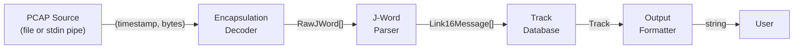
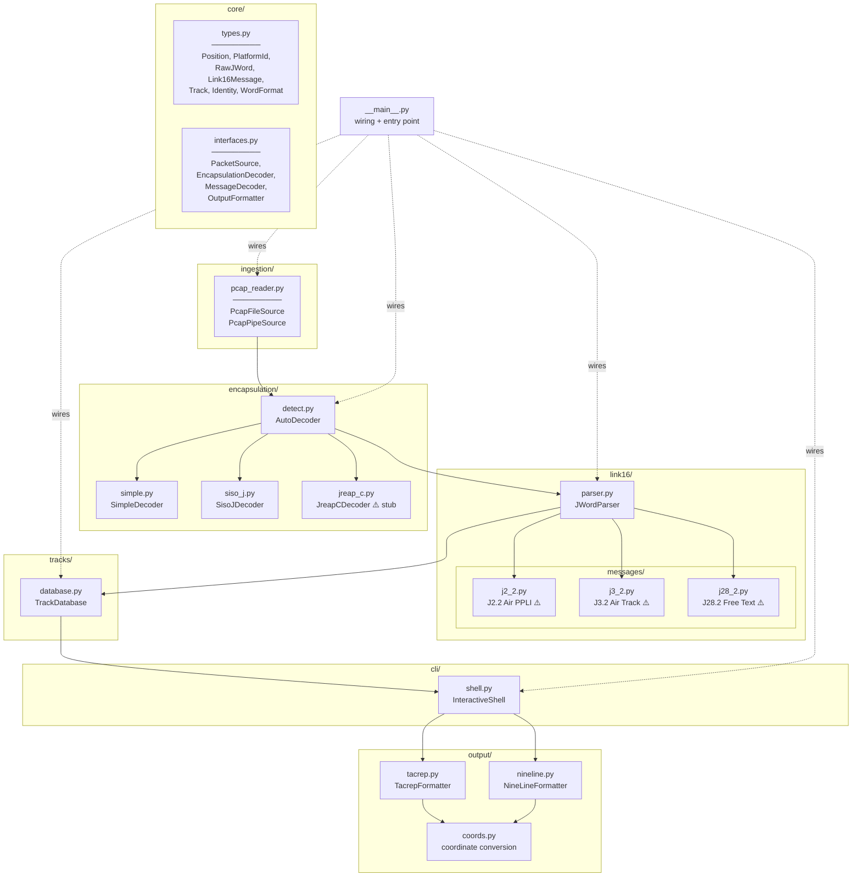
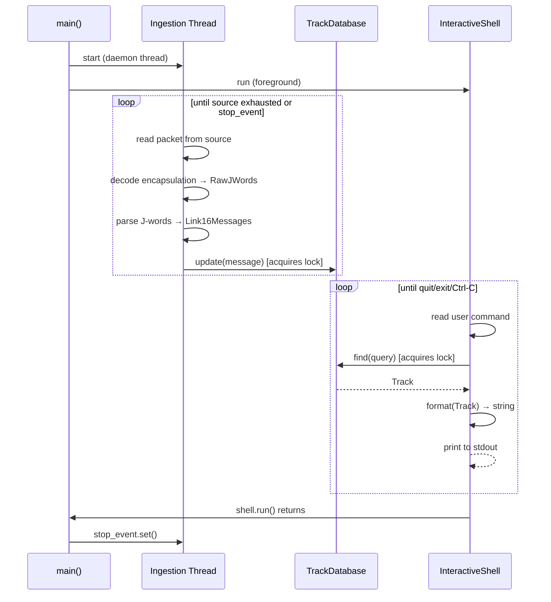
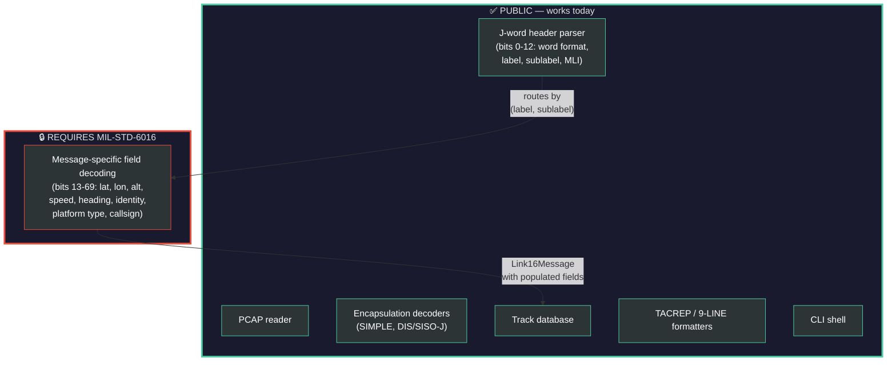

# Architecture Overview

JREAP-C Parser is a modular pipeline that transforms raw PCAP network
captures containing Link 16 tactical data link traffic into formatted
tactical reports (TACREPs) and other structured output.

---

## Data Flow

The system is a linear pipeline. Each stage consumes one data type and
produces the next. No stage knows the internals of any other — they
communicate only through the shared types defined in `core/types.py`.



### Stage-by-stage

| Stage | Package | Input | Output | Notes |
|-------|---------|-------|--------|-------|
| **Ingestion** | `ingestion/` | PCAP bytes (file or pipe) | `(float, bytes)` tuples | Strips Ethernet/IP/UDP\|TCP headers |
| **Encapsulation** | `encapsulation/` | UDP/TCP payload bytes | `list[RawJWord]` | Pluggable: SIMPLE, SISO-J, JREAP-C, Auto |
| **J-Word Parsing** | `link16/` | `list[RawJWord]` | `list[Link16Message]` | Header parsing (public) + message decoding (needs MIL-STD-6016) |
| **Track DB** | `tracks/` | `Link16Message` | `Track` (stored) | In-memory, thread-safe, keyed by STN |
| **Formatting** | `output/` | `Track` | `str` | Pluggable: TACREP, 9-LINE, future formats |
| **CLI** | `cli/` | User commands | Formatted reports | Interactive shell, queries the Track DB |

---

## Module Map



Items marked **⚠️** are stubs awaiting MIL-STD-6016 access.

---

## Threading Model



Two threads, one shared resource (`TrackDatabase`), protected by a
single `threading.Lock`. The ingestion thread is the sole writer; the
CLI thread is the sole reader.

---

## The MIL-STD-6016 Boundary

This is the most important architectural line in the project. Everything
above it works with publicly documented specs. Everything below it
requires the restricted standard.



**When MIL-STD-6016 becomes available**, the only files that change are
the message decoders in `link16/messages/` (e.g. `j2_2.py`, `j3_2.py`).
No other module is affected.

---

## Pluggable Extension Points

The architecture has three pluggable seams — places where you can add
new implementations without modifying existing code (beyond wiring).

| Extension Point | Protocol | Where to add | How to register |
|----------------|----------|--------------|-----------------|
| **Encapsulation format** | `EncapsulationDecoder` | `encapsulation/` | `detect.py` + `__main__.py` |
| **Message type decoder** | `MessageDecoder` | `link16/messages/` | `__main__.py` → `parser.register()` |
| **Output format** | `OutputFormatter` | `output/` | `__main__.py` → `formatters` dict |

Each pluggable package has a detailed "How to extend" guide in its
`__init__.py` file.

---

## Key Design Decisions

**No external dependencies for core parsing.** The PCAP reader, header
parsing, and formatters use only the Python standard library (`struct`,
`dataclasses`, `threading`). This keeps the tool deployable on minimal
Linux environments without `pip install`.

**Auto-detection over configuration.** The `AutoDecoder` inspects each
packet's magic bytes to determine the encapsulation format. Users don't
need to know (or specify) whether the capture uses SIMPLE vs.
DIS vs. JREAP-C — it just works. Manual override is available via
`--encap` for edge cases.

**Non-destructive track merging.** When `TrackDatabase.update()` receives
a message, it only overwrites fields that are non-None. A J2.2 PPLI
(which carries position but not identity) won't clobber the identity
previously set by a J3.2 Air Track. This means the track accumulates
the best-known state from all message types.

**Stubs over dead code.** The message decoders exist as real classes
that return real `Link16Message` objects — they just don't populate
the fields yet. This means the full pipeline runs end-to-end today
(ingestion → parsing → track DB → TACREP output), and filling in the
field decoding is a matter of writing bit-extraction code inside the
existing `decode()` methods.

---

## File Listing

```
jreap-c-parser/
├── ARCHITECTURE.md              ← you are here
├── pyproject.toml               ← package metadata, CLI entry point
├── jreap_parser/
│   ├── __init__.py
│   ├── __main__.py              ← wiring + entry point
│   ├── core/
│   │   ├── types.py             ← shared data types (the pipeline's currency)
│   │   └── interfaces.py        ← Protocol definitions for pluggable modules
│   ├── ingestion/
│   │   └── pcap_reader.py       ← PCAP file + stdin pipe sources
│   ├── encapsulation/
│   │   ├── __init__.py          ← "How to add an encapsulation format"
│   │   ├── simple.py            ← STANAG 5602 (fully implemented)
│   │   ├── siso_j.py            ← DIS Signal PDU (fully implemented)
│   │   ├── jreap_c.py           ← MIL-STD-3011 (stub)
│   │   └── detect.py            ← auto-detection heuristic
│   ├── link16/
│   │   ├── parser.py            ← J-word header parsing + decoder registry
│   │   └── messages/
│   │       ├── __init__.py      ← "How to add a message decoder"
│   │       ├── j2_2.py          ← J2.2 Air PPLI (stub)
│   │       ├── j3_2.py          ← J3.2 Air Track (stub)
│   │       └── j28_2.py         ← J28.2 Free Text (stub)
│   ├── tracks/
│   │   └── database.py          ← in-memory track store
│   ├── output/
│   │   ├── __init__.py          ← "How to add an output format"
│   │   ├── coords.py            ← decimal degrees ↔ military grid
│   │   ├── tacrep.py            ← 5-line AIROP TACREP
│   │   └── nineline.py          ← 9-line convenience format
│   └── cli/
│       └── shell.py             ← interactive CLI shell
└── tests/
    └── __init__.py
```
